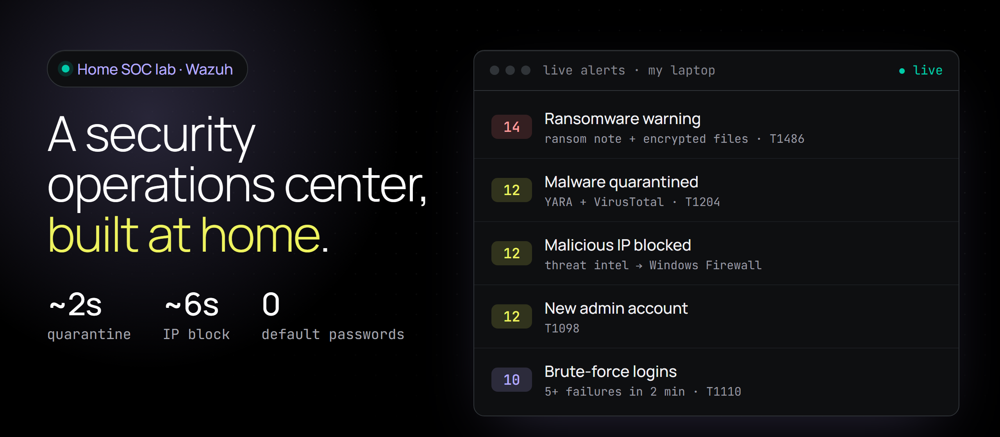
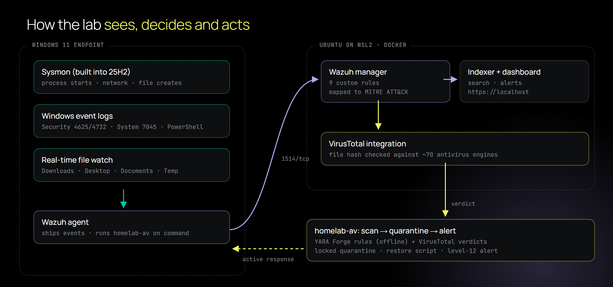

<p align="center">
  
</p>

<p align="center">
  
  
  
  
  <a href="LICENSE"></a>
</p>

# Home SOC Lab

**A small security operations center I built on my own laptop to do what a SOC analyst does:** collect endpoint telemetry, write detections, prove them with safe tests, tune out false positives, and respond automatically when something bad shows up.

Everything here is real and was tested on my machine: every alert in the banner above fired from my own test scripts. The whole stack runs in Docker, so it can move to a cloud server unchanged.

<p align="center">
  
</p>

## What it detects

| Rule | Detection | MITRE ATT&CK | Proven by |
|---|---|---|---|
| 100100 | 5+ failed Windows logons in 2 minutes | T1110 Brute Force | `tests/test-failed-logons.ps1` ✅ |
| 100110 | Account added to the local Administrators group | T1098, T1136.001 | `tests/test-new-admin.ps1` ✅ |
| 100120 | PowerShell download-and-run or encoded command | T1059.001, T1027 | `tests/test-encoded-powershell.ps1` ✅ |
| 100130 | Scheduled task created with `schtasks /create` | T1053.005 | `tests/test-scheduled-task.ps1` ✅ |
| 100131 | New Windows service installed (Event 7045) | T1543.003 | fired on real installs ✅ |
| 100140 | Discovery commands (`whoami`, `net user`, `systeminfo`) | T1033, T1087.001, T1082 | `tests/test-recon.ps1` ✅ |
| 100141 | Burst of 3+ discovery commands in a minute | T1033, T1087.001, T1082 | `tests/test-recon.ps1` ✅ |
| 100150 | Malicious file quarantined by the lab scanner | T1204.002 | `malware-defense/test-quarantine-loop.ps1` ✅ |

Every test is harmless: it prints text, creates and deletes a dummy task or account, fails a logon with a made-up user, or drops a lab-only marker file (like EICAR, but only this lab's rule matches it).

## Malware defense: my own small antivirus

Microsoft Defender stays on. This is a second, transparent layer that I can read, test and explain line by line.

1. **Watch.** Wazuh file integrity monitoring watches Downloads and Desktop (every file) and Documents and Temp (risky types only: `.exe .dll .ps1 .js .msi .lnk .iso .docm` and more) in real time.
2. **Decide.** Each new or changed file is scanned offline with ~3,000 [YARA Forge](https://github.com/YARAHQ/yara-forge) rules and, once a free API key is saved (step 8 below), its hash is checked against ~70 antivirus engines through Wazuh's VirusTotal integration.
3. **Act.** A hit moves the file into a locked quarantine folder (SYSTEM and Administrators only), records its original path, SHA-256 and the reason, and raises a level-12 alert. `restore-quarantine.ps1` lists and restores false positives.

```text
$ make-test-file.ps1
Created c:\users\<you>\downloads\homelab-yara-test.txt
homelab-av: QUARANTINED id=076eebb52a50 reason="YARA: HomeLab_Test_Marker"   # about 4 seconds later
Lab: malicious file quarantined by the lab scanner   (level 12, T1204.002)
$ restore-quarantine.ps1 -Id 076eebb52a50
Restored c:\users\<you>\downloads\homelab-yara-test.txt
```

## Protection features (tested end to end)

| Feature | How it works | Result in testing |
|---|---|---|
| Real-time malware quarantine | FIM → YARA Forge + VirusTotal → locked quarantine + restore script | lab test file quarantined in ~2 s |
| Known-malware hashes | 1,500 fresh SHA-256s from MalwareBazaar, refreshed daily | quarantined on match (rule 100172) |
| Firewall auto-block | 17,700 bad IPs (Feodo Tracker + IPsum) and 400 malware domains (URLhaus); a hit adds inbound + outbound Windows Firewall blocks | connection detected and blocked in ~6 s, then unblocked |
| Ransomware early warning | ransom-note names and encrypted extensions (level 14), 25+ new or changed files a minute (level 13) | 31-file simulation flagged instantly |
| Weekly full scan | Wazuh agent command module runs YARA over Downloads, Desktop and Documents every week | summary alert per scan |
| Pop-up notifications | SYSTEM-side scripts write an event feed; a small user-session helper turns it into Windows notifications | "Home SOC quarantined a threat" pop-up |

Threat feeds refresh every morning (`server/update-threat-intel.sh` via cron). `malware-defense/unblock-ip.ps1` lists and removes blocks.

## What I learned

- **Rule order matters.** My bad-IP rule never fired at first: Wazuh's built-in "PowerShell communicating over TCP" rule claims those network events before a sibling rule sees them. Attaching the rule to the built-in event-3 rules fixed it, and the IP block test passed.
- **Know the field names.** FIM events are matched on `file` and `sha256`, not `syscheck.path`; my first ransomware rule silently never matched.

- **Real findings on day one.** The new-service rule flagged two real installs on my PC (an app update and an antivirus task). Both were legitimate, which is the everyday SOC job: check, confirm, document.
- **Day-one triage: 300+ alerts, zero attacks.** I went through every alert of level 7 or higher. 223 came from one file: PowerShell writes a `__PSScriptPolicyTest_*` script to Temp on every start (an app-control check), and Wazuh's malware-folder rules scored it as high as level 15. Others were Opera's signed updater, Windows services whose parent Sysmon didn't record, and Wazuh's own CIS scan running `net accounts`. Each got a narrow tuning rule (`100142`, `100160`-`100164`) that matches only the verified benign pattern, so the original rule still fires for anything else. Encoded PowerShell stays alerting on purpose: my AI agent uses it, and so do attackers.
- **Tuning false positives.** My first PowerShell rule also matched `-ExecutionPolicy Bypass`, which normal tools use constantly: 10 alerts in a few minutes, none malicious. My first recon rule counted every `net start`. I narrowed both.
- **Know the built-in rules.** Wazuh's own rule 92057 catches encoded PowerShell first, so my rule became a backstop for download cradles instead of a duplicate.
- **Test the test.** My first brute-force test used a loopback `net use` login. It failed every time, but Windows never logged it as Event 4625, so the rule looked broken. A local logon attempt produced the events.
- **The scanner caught itself.** It quarantined its own YARA rules file (it contains every signature, so of course it matches) and one of my test scripts. Rule files are now skipped, and the test marker is assembled at run time.
- **Config that survives restarts.** The Wazuh Docker image copies a template over `ossec.conf` whenever the container is recreated, which silently wiped my active response. Changes now go into the template (`config/wazuh_cluster/wazuh_manager.conf`).
- **Default credentials are a finding.** Both the dashboard admin and the API user ship with publicly known passwords. `server/change-admin-password.sh` and `server/change-api-password.sh` replace them and confirm the old ones are rejected (HTTP 401).
- **Windows 11 25H2 ships Sysmon built in.** The standalone installer fails there (`wevtutil.exe returned failure`); the fix is the optional feature plus a restart.
- **WSL2 stops when idle**, which silently killed the SIEM. `vmIdleTimeout=-1` keeps it up.

## Run it yourself

**Pick one setup:**

| | A. One Windows PC | B. Always-on cloud server (what I run) |
|---|---|---|
| Cost | $0 | $0 (Oracle Cloud Always Free) |
| Keeps watching when the PC is off | No | Yes |
| Open to the internet | Nothing (localhost only) | Nothing (Tailscale only, zero public ports) |
| Phone access / personal VPN | While the PC is on | Always |

**If anything goes wrong:** [docs/TROUBLESHOOTING.md](docs/TROUBLESHOOTING.md) lists every problem hit while building this (Oracle capacity, API key errors, a stuck dashboard, Tailscale policy not saving...) with the fix. The cloud setup takes about 1-2 hours of your time, plus however long Oracle takes to free up a VM.

**Before you start (safety):**

- Only run this on computers you own. Everything in `tests\` is a harmless simulation (made-up logons, a text file with a test marker, a temporary *disabled* user).
- Read a script before running it as Administrator/root; each one explains itself in its first lines. Downloads come only from official sources (Wazuh, Docker, Tailscale, Microsoft), and the Wazuh agent installer's signature is checked.
- Passwords are generated for you and saved only on the server in `/root/lab-credentials.txt` (root-only). Nothing secret is ever written to the repo; `.gitignore` blocks logs and key files.
- Get the code: `git clone https://github.com/ChanceHart/home-soc-lab.git`

### A. One Windows PC (Wazuh in WSL)

| Step | Where | Command |
|---|---|---|
| 1. WSL2 + Ubuntu | PowerShell (admin) | `wsl --install -d Ubuntu-24.04`, restart, copy `wslconfig.example` to `%UserProfile%\.wslconfig`, `wsl --shutdown` |
| 2. Wazuh server | Ubuntu (root) | `bash server/setup-wazuh.sh` |
| 3. Kill default passwords | Ubuntu (root) | `bash server/change-admin-password.sh && bash server/change-api-password.sh` |
| 4. Detections | Ubuntu (root, repo root) | `bash server/load-rules.sh` |
| 5. Windows agent + Sysmon | PowerShell (admin) | `windows\install-agent.ps1`, then `windows\enable-sysmon.ps1`, restart Windows |
| 6. Failed-logon auditing | PowerShell (admin) | `auditpol /set /subcategory:"Logon" /failure:enable` |
| 7. Malware defense | PowerShell (admin) | `malware-defense\install-malware-defense.ps1`, then `bash server/enable-malware-defense.sh` |
| 8. VirusTotal (optional) | PowerShell | `windows\save-virustotal-key.ps1`, then rerun `server/enable-malware-defense.sh` |
| 9. Prove it | PowerShell | scripts in `tests\` and `malware-defense\test-quarantine-loop.ps1`; watch https://localhost |
| 10. One-click open | PowerShell | `windows\install-shortcut.ps1` (no admin) |

### B. Always-on cloud server (Oracle Cloud Always Free + Tailscale)

The Wazuh server runs 24/7 on an Oracle Cloud Ampere A1 VM (4 Arm CPUs, 24 GB RAM). The Windows PC is the monitored endpoint and reaches the server only over Tailscale.

| Step | Where | Command |
|---|---|---|
| 1. Accounts | browser | Oracle Cloud Free Tier (Pay As You Go upgrade gets capacity much faster and still costs $0 inside the free limits; set a $1 budget alert), Tailscale (free) |
| 2. Oracle API key (guided) | your PC | `pip install oci`, then `python cloud/setup_oci_key.py` (shows the exact clicks, checks what you paste) |
| 3. VM + network | your PC | `python cloud/launch_vm.py --fallback-after 1` (keeps retrying until Oracle has capacity; can take minutes to hours; never launches twice) |
| 4. Base setup | VM, as root | `bash cloud/01-base.sh`, then `tailscale up --advertise-exit-node --hostname=home-lab-cloud` |
| 5. Hardened Wazuh | VM, as root, from the repo folder | put your VirusTotal key in `/root/virustotal.key` (optional), then `bash cloud/02-wazuh.sh` |
| 6. Lock down SSH | VM, as root, **logged in over Tailscale** | `bash cloud/04-lockdown.sh`, then delete the port 22 rule in the Oracle security list |
| 7. Tailscale settings | Tailscale admin console | Access controls: paste `cloud/tailscale-policy.example.hujson` with your IPs (check line 1 before Save). Machines > server: **Disable key expiry**, **Use as exit node** |
| 8. Windows endpoint | PowerShell (admin) | steps 5-8 of setup A with `install-agent.ps1 -Manager <server Tailscale IP>`, then `cloud\03-move-agent.ps1 -Manager <server Tailscale IP>` (asks for the enrollment password) |
| 9. Check everything | PowerShell | `.\cloud\verify.ps1 -Server <server Tailscale IP> -PublicIp <server public IP>`: every line PASS/WARN/FAIL with its fix |
| 10. Prove it + one-click open | PowerShell | step 9 of setup A, then `windows\install-shortcut.ps1 -Remote -Url https://<server>.<tailnet>.ts.net` |

**Hardening built in (pen-tested 2026-10-07):** zero ports open to the internet (full 65,535-port scan); dashboard, API and indexer bound to `127.0.0.1` (dashboard only via `tailscale serve`); a `DOCKER-USER` rule keeps Docker from publishing ports on the public network card and blocks containers from the cloud metadata service; agent enrollment password (rogue enrollment refused); random admin/API passwords; SSH keys-only, no root, no forwarding, Tailscale-only; config files with secrets root-only; alerts auto-deleted after 90 days (data minimization); unattended security updates; the server can't open connections to your devices (Tailscale policy); Oracle's idle-reclaim rule avoided (indexer heap keeps memory above 20%). Survives a reboot with everything coming back on its own.

### Open the lab any time

`windows\install-shortcut.ps1` adds a **Home SOC Lab** shortcut to the Desktop and Start menu. Double-click it and it:

1. wakes the lab (starts WSL and Docker; the Wazuh containers restart on their own),
2. waits until the dashboard answers,
3. opens it in your browser and copies the admin password to the clipboard for 45 seconds (then clears it).

| Your setup | Command |
|---|---|
| Local lab in WSL (default) | `windows\install-shortcut.ps1` |
| Different WSL distro | `windows\install-shortcut.ps1 -Distro Ubuntu-22.04` |
| Cloud/remote lab over Tailscale | `windows\install-shortcut.ps1 -Remote -Url https://<server>.<tailnet>.ts.net -Ssh ubuntu@<server Tailscale IP> -SshKey <key>` |
| Linux / macOS | `server/open-homelab.sh` (or `URL=https://<server>.<tailnet>.ts.net server/open-homelab.sh`) |

On a phone, install Tailscale and bookmark the `https://<server>.<tailnet>.ts.net` address (served by `tailscale serve`, reachable only from your own devices).

### Secure remote access + personal VPN (Tailscale)

No ports are opened to the internet. Everything rides on Tailscale (WireGuard):

| Goal | How | Result |
|---|---|---|
| Dashboard from phone/laptop anywhere | `tailscale serve --bg https+insecure://localhost:443` on the lab machine | `https://<lab>.<tailnet>.ts.net` with a real, trusted certificate; only your devices can reach it |
| Personal VPN on public Wi-Fi | `tailscale set --advertise-exit-node` on the lab machine, approve it in the admin console, pick it as **Exit node** on the phone | All phone traffic leaves through the lab |
| Nothing exposed publicly | Wazuh admin ports bound to `127.0.0.1`; dashboard reached only through Tailscale | Smaller attack surface |

```text
rules/             custom Wazuh rules (local_rules.xml)
cloud/             always-on cloud server: key setup, VM launcher, base setup, hardened Wazuh, SSH lockdown, Tailscale policy, health check
docs/              troubleshooting guide, screenshots
server/            Docker + Wazuh setup, password hardening, rule loading, malware-defense config
windows/           agent install, built-in Sysmon, VirusTotal key helper, one-click open shortcut
malware-defense/   homelab-av scanner, installer, quarantine restore, end-to-end test
tests/             safe attack simulations, one per detection
assets/            banner and diagram (HTML sources in assets/source)
```

## Next

- Enroll a Linux endpoint with auditd (the cloud VM's own agent already reports SSH and sudo activity)
- Active response that blocks an IP after a brute-force alert
- Map coverage in the MITRE ATT&CK Navigator

---

Built by **[Chance Hart](https://chancehart.github.io)** while studying for CompTIA Security+. Also see **[claude-session-saver](https://github.com/ChanceHart/claude-session-saver)**.
